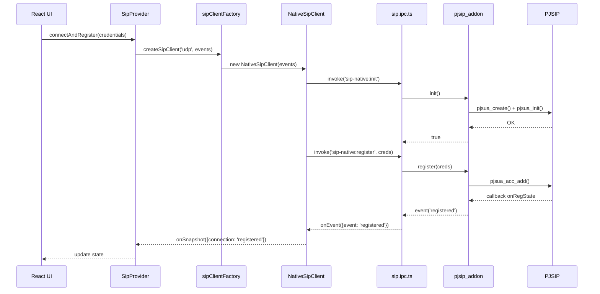
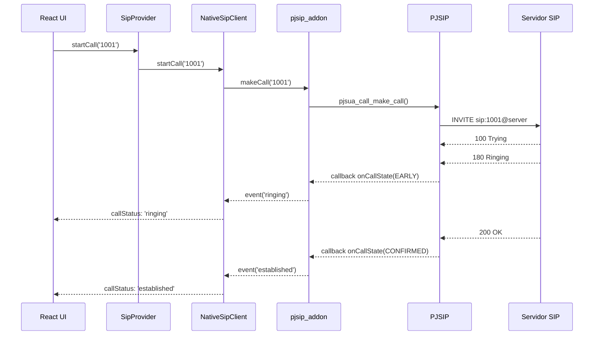

# Integração do Módulo Nativo PJSIP - Echo Softphone

Este documento descreve em detalhes como integrar e compilar o módulo nativo PJSIP para suporte a transporte UDP/TCP no Echo Softphone.

## Índice

1. [Visão Geral](#visão-geral)
2. [Arquitetura](#arquitetura)
3. [Pré-requisitos](#pré-requisitos)
4. [Instalação e Compilação](#instalação-e-compilação)
5. [Estrutura de Arquivos](#estrutura-de-arquivos)
6. [API do Módulo Nativo](#api-do-módulo-nativo)
7. [Fluxo de Comunicação](#fluxo-de-comunicação)
8. [Troubleshooting](#troubleshooting)
9. [Contribuindo](#contribuindo)

---

## Visão Geral

O Echo Softphone agora suporta dois backends de comunicação SIP:

| Protocolo | Backend | Biblioteca | Mídia |
|-----------|---------|------------|-------|
| **WSS** (WebSocket Secure) | sip.js | JavaScript | WebRTC |
| **UDP/TCP** | PJSIP | C/C++ Nativo | RTP |

O módulo nativo é **opcional**. Se não estiver compilado, o aplicativo funciona normalmente usando apenas WebSocket (sip.js).

### Vantagens do Módulo Nativo

- **Performance**: PJSIP é altamente otimizado em C
- **Compatibilidade**: Funciona com qualquer servidor SIP que suporte UDP/TCP
- **Recursos avançados**: SRTP, múltiplos codecs, QoS
- **Menor latência**: Comunicação direta sem overhead de WebSocket

---

## Arquitetura

```
┌─────────────────────────────────────────────────────────────────┐
│                     RENDERER PROCESS (React)                     │
├─────────────────────────────────────────────────────────────────┤
│                                                                  │
│  ┌─────────────┐         ┌──────────────────┐                   │
│  │ SipProvider │────────▶│ sipClientFactory │                   │
│  └─────────────┘         └────────┬─────────┘                   │
│                                   │                              │
│              ┌────────────────────┼────────────────────┐        │
│              ▼                    ▼                    ▼        │
│     ┌────────────────┐   ┌────────────────┐   ┌──────────────┐  │
│     │   SipClient    │   │NativeSipClient │   │    (outro)   │  │
│     │   (sip.js)     │   │   (via IPC)    │   │              │  │
│     └───────┬────────┘   └───────┬────────┘   └──────────────┘  │
│             │                    │                               │
│             ▼                    ▼                               │
│     ┌────────────────┐   ┌────────────────┐                     │
│     │    WebRTC      │   │   IPC Bridge   │                     │
│     └───────┬────────┘   └───────┬────────┘                     │
│             │                    │                               │
└─────────────┼────────────────────┼───────────────────────────────┘
              │                    │
              ▼                    ▼
┌─────────────────────────────────────────────────────────────────┐
│                      MAIN PROCESS (Electron)                     │
├─────────────────────────────────────────────────────────────────┤
│                                                                  │
│                    ┌────────────────────┐                        │
│                    │    sip.ipc.ts      │                        │
│                    └─────────┬──────────┘                        │
│                              │                                   │
│                              ▼                                   │
│                    ┌────────────────────┐                        │
│                    │  pjsip_addon.node  │                        │
│                    │    (N-API C++)     │                        │
│                    └─────────┬──────────┘                        │
│                              │                                   │
│                              ▼                                   │
│                    ┌────────────────────┐                        │
│                    │      PJSIP         │                        │
│                    │  (SIP + RTP/SRTP)  │                        │
│                    └────────────────────┘                        │
│                                                                  │
└─────────────────────────────────────────────────────────────────┘
```

---

## Pré-requisitos

### Windows

1. **Visual Studio 2019 ou 2022** com:
   - Desenvolvimento para desktop com C++
   - Ferramentas de build do Windows 10 SDK

2. **Node.js 18+** (LTS recomendado)

3. **Python 3.x** (para node-gyp)

4. **Git**

```powershell
# Verificar instalações
node --version   # v18.x ou superior
python --version # 3.x
git --version
```

### Linux (Ubuntu/Debian)

```bash
# Dependências de compilação
sudo apt-get update
sudo apt-get install -y \
    build-essential \
    python3 \
    python3-pip \
    git \
    libasound2-dev \
    uuid-dev \
    libssl-dev

# Node.js 18+
curl -fsSL https://deb.nodesource.com/setup_18.x | sudo -E bash -
sudo apt-get install -y nodejs
```

### macOS

```bash
# Xcode Command Line Tools
xcode-select --install

# Homebrew (se não tiver)
/bin/bash -c "$(curl -fsSL https://raw.githubusercontent.com/Homebrew/install/HEAD/install.sh)"

# Dependências
brew install python node
```

---

## Instalação e Compilação

### Passo 1: Clonar o Repositório

```bash
git clone https://github.com/adelson70/softphonejs.git
cd softphonejs
npm install
```

### Passo 2: Configurar PJSIP

```bash
# Baixa e configura PJSIP automaticamente
npm run native:setup
```

Este script:
1. Clona PJSIP 2.14.1 em `native/deps/pjproject`
2. Cria `config_site.h` otimizado
3. No Linux/macOS: configura e compila automaticamente
4. No Windows: instruções para Visual Studio

### Passo 3: Compilar Módulo Nativo

#### Linux/macOS

```bash
npm run native:build
```

#### Windows

**Opção A: PowerShell (automático)**

```powershell
.\scripts\build-pjsip-windows.ps1
npm run native:build
```

**Opção B: Visual Studio (manual)**

1. Abra `native/deps/pjproject/pjproject-vs14.sln`
2. Configure para **Release | x64**
3. Build > Build Solution
4. Execute `npm run native:build`

### Passo 4: Verificar Instalação

```bash
npm run postinstall
```

Saída esperada:
```
============================================================
Echo Softphone - Verificação do Módulo Nativo
============================================================

PJSIP fonte: ✓ Encontrado
Addon nativo: ✓ Compilado

------------------------------------------------------------

✓ Módulo nativo está pronto!
  Suporte a UDP e TCP está habilitado.

============================================================
```

### Passo 5: Build do Aplicativo

```bash
# Build completo (nativo + electron)
npm run build:full

# Ou apenas o app (se nativo já compilado)
npm run build
```

---

## Estrutura de Arquivos

```
softphonejs/
├── native/                          # Módulo nativo C++
│   ├── binding.gyp                  # Config node-gyp
│   ├── CMakeLists.txt               # Config cmake-js (alternativa)
│   ├── package.json                 # Dependências do módulo
│   ├── src/
│   │   ├── pjsip_addon.cpp          # Entry point N-API
│   │   ├── sip_engine.cpp           # Wrapper PJSIP
│   │   ├── sip_engine.h
│   │   ├── audio_device.cpp         # Gerenciamento de áudio
│   │   ├── audio_device.h
│   │   ├── event_emitter.cpp        # Eventos thread-safe
│   │   └── event_emitter.h
│   ├── deps/
│   │   └── pjproject/               # PJSIP source
│   └── build/
│       └── Release/
│           └── pjsip_addon.node     # Binário compilado
│
├── electron/
│   ├── ipc/
│   │   └── sip.ipc.ts               # IPC handlers
│   └── preload.ts                   # Bridge para renderer
│
├── src/sip/
│   ├── core/
│   │   ├── sipClient.ts             # Cliente sip.js (WSS)
│   │   ├── sipClientFactory.ts      # Factory de clientes
│   │   └── sipClientInterface.ts    # Interface comum
│   ├── native/
│   │   └── nativeSipClient.ts       # Cliente nativo (UDP/TCP)
│   └── react/
│       └── SipProvider.tsx          # Provider React
│
└── scripts/
    ├── setup-pjsip.js               # Setup automático
    ├── build-pjsip-windows.ps1      # Build Windows
    ├── rebuild-native.js            # Rebuild para Electron
    └── check-native.js              # Verificação
```

---

## API do Módulo Nativo

### Funções Exportadas (N-API)

```typescript
// Lifecycle
init(): boolean
destroy(): void
isInitialized(): boolean

// Registration
register(credentials: {
  username: string
  password: string
  server: string
  port: number
  transport: 'udp' | 'tcp'
}): boolean
unregister(): boolean

// Calls
makeCall(target: string): boolean
answerCall(): boolean
rejectCall(): boolean
hangupCall(): boolean

// DTMF
sendDtmf(digits: string): boolean

// Transfer
transferBlind(target: string): boolean
transferAttended(target: string): boolean

// Audio
setMuted(muted: boolean): void
toggleMuted(): boolean
isMuted(): boolean
getAudioDevices(): AudioDevice[]
setAudioDevices(captureId: number, playbackId: number): boolean

// State
getSnapshot(): SipSnapshot
setEventCallback(callback: (event, payload) => void): void
clearEventCallback(): void
```

### Eventos Emitidos

| Evento | Payload | Descrição |
|--------|---------|-----------|
| `registered` | `{}` | Registro bem sucedido |
| `unregistered` | `{}` | Desregistrado |
| `incomingCall` | `{incoming: {...}}` | Chamada entrante |
| `dialing` | `{}` | Discando |
| `ringing` | `{}` | Tocando no destino |
| `established` | `{}` | Chamada conectada |
| `terminated` | `{}` | Chamada encerrada |
| `transferSuccess` | `{}` | Transferência OK |
| `transferFailed` | `{lastError}` | Transferência falhou |
| `dtmfReceived` | `{digit}` | DTMF recebido |
| `muteChanged` | `{muted}` | Mute alterado |

---

## Fluxo de Comunicação

### Registro SIP (UDP/TCP)



### Chamada de Saída



---

## Troubleshooting

### Erro: "Módulo nativo não disponível"

**Causa**: Addon não compilado ou não encontrado.

**Solução**:
```bash
npm run native:build
npm run postinstall  # Verificar
```

### Erro: "node-gyp rebuild failed" (Windows)

**Causa**: Visual Studio não configurado corretamente.

**Solução**:
```powershell
npm config set msvs_version 2019
npm run native:build
```

### Erro: "ALSA lib" (Linux)

**Causa**: Dependências de áudio faltando.

**Solução**:
```bash
sudo apt-get install libasound2-dev
npm run native:build
```

### Erro: "Registration failed"

**Causa**: Credenciais ou servidor incorretos.

**Verificar**:
1. Servidor SIP está acessível na porta (UDP 5060)
2. Credenciais estão corretas
3. Firewall permite tráfego UDP

### Sem áudio durante chamada

**Causa**: Dispositivo de áudio não configurado ou bloqueado.

**Solução**:
1. Verificar dispositivos: `sipNative.getAudioDevices()`
2. Verificar permissões de microfone do SO
3. Em Linux, verificar PulseAudio/PipeWire

---

## Contribuindo

### Compilando em modo Debug

```bash
# Linux/macOS
cd native
node-gyp rebuild --debug

# Windows (Visual Studio)
# Configure para Debug em vez de Release
```

### Adicionando logs

```cpp
// Em sip_engine.cpp
PJ_LOG(4, ("SipEngine", "Mensagem de debug: %s", variavel));
```

### Testes

```bash
# Executar app em modo dev com logs
npm run dev

# Ver logs do módulo nativo
# Os logs PJSIP aparecem no console do main process
```

---

## Licença

Este projeto utiliza:
- **PJSIP**: GPL v2 ou licença comercial
- **sip.js**: MIT
- **Echo Softphone**: MIT

Para uso comercial do módulo nativo, verifique a licença do PJSIP.

---

## Suporte

- Issues: [GitHub Issues](https://github.com/adelson70/softphonejs/issues)
- Documentação PJSIP: [pjsip.org](https://www.pjsip.org/docs/latest/)
- Documentação sip.js: [sipjs.com](https://sipjs.com/api/)
